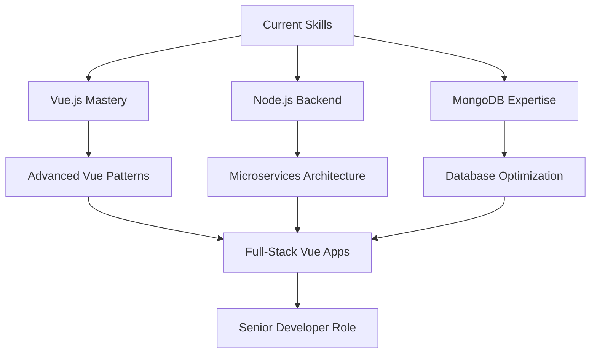

<div align="center">
  
</div>

<div align="center">
  
</div>

<div align="center">
  
  
  
</div>

---


### 👨‍💻 About Me

```typescript
interface Developer {
  name: string;
  location: string;
  currentProject: string;
  learning: string[];
  expertise: string[];
  hobbies: string[];
  contact: string;
}

const monthy: Developer = {
  name: "Monthy",
  location: "Battambang, Cambodia 🇰🇭",
  currentProject: "HR Management System",
  learning: ["Vue.js", "Node.js", "MongoDB"],
  expertise: ["Fullstack Development", "Web Apps", "Database Design"],
  hobbies: ["Gundam Models", "Tech Articles", "Open Source"],
  contact: "github.com/snoopylazy"
};
```

<br clear="right"/>

## 🎯 Current Focus

<table>
<tr>
<td width="50%">

### 🏢 Professional
- 🔭 **Building:** HR Management System
- 🌱 **Mastering:** Vue.js ecosystem & Node.js
- 👯 **Collaborating:** Mission request letters
- 🎯 **Goal:** Becoming a Vue.js expert

</td>
<td width="50%">

### 🚀 Personal
- 📝 **Writing:** [Tech Articles](https://snoopylazy.github.io/MyDetails.github.io/)
- 🎨 **Designing:** User-friendly interfaces  
- 🎮 **Hobby:** Gundam model building
- ☕ **Fuel:** Coffee & curiosity

</td>
</tr>
</table>

## 🛠️ Tech Arsenal

<details open>
<summary><b>🎨 Frontend Development</b></summary>
<br>


</details>

<details>
<summary><b>⚙️ Backend Development</b></summary>
<br>


</details>

<details>
<summary><b>🗄️ Databases</b></summary>
<br>


</details>

<details>
<summary><b>📱 Mobile Development</b></summary>
<br>


</details>

<details>
<summary><b>☁️ DevOps & Tools</b></summary>
<br>


</details>

## 📊 GitHub Analytics

<div align="center">
  
  
</div>

<div align="center">
  
</div>

<div align="center">
  
</div>

## 🏆 Achievements

<div align="center">
  
</div>

## 🎯 2024 Goals & Learning Path



## 📝 Recent Articles & Projects

<div align="center">

| 📚 **Latest Articles** | 🔗 **Featured Projects** |
|---|---|
| [My Developer Journey](https://snoopylazy.github.io/MyDetails.github.io/) | [HR Management System](https://github.com/snoopylazy) |
| [Vue.js Best Practices](https://snoopylazy.github.io/MyDetails.github.io/) | [Restaurant Management](https://github.com/snoopylazy/Restaurant.git) |
| [Experience & Resume](https://snoopylazy.github.io/Reanmore/) | [Mission Request Letters](https://github.com/snoopylazy) |

</div>

## 🤝 Let's Connect & Collaborate

<div align="center">

[](https://snoopylazy.github.io/MyDetails.github.io/)
[](https://github.com/snoopylazy)
[](https://snoopylazy.github.io/Reanmore/)
[](https://github.com/snoopylazy)

</div>

---

<div align="center">
  
</div>

<div align="center">
  
### 💭 "Building the future, one commit at a time"

**Fun Facts About Me:**
- 🎮 Gundam model enthusiast - precision in both code and models
- ☕ Coffee-driven development - best code written at 2 AM
- 🌏 Proud to represent Cambodia in the global dev community
- 🚀 Always excited about the next big technology trend

</div>

<div align="center">
  
</div>

<div align="center">
  <sub>⭐️ Made with ❤️ by <a href="https://github.com/snoopylazy">Monthy</a> | Cambodia 🇰🇭</sub>
</div>
